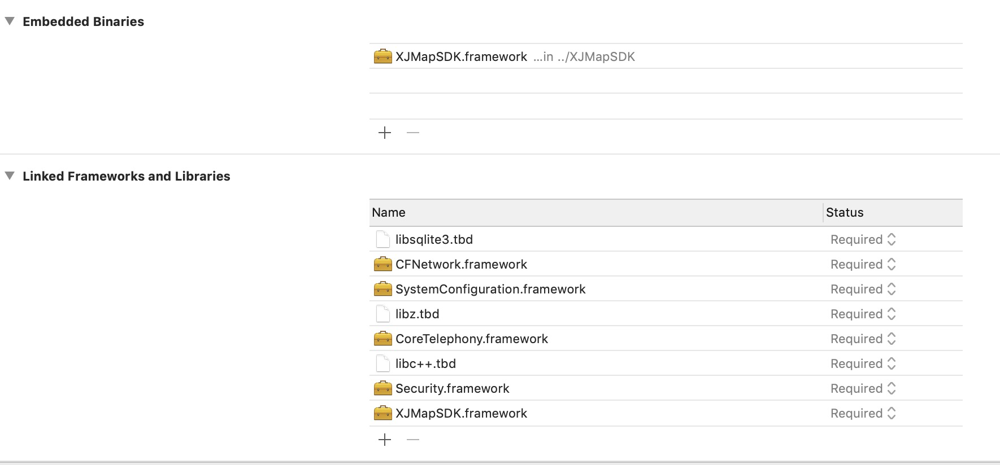

# XJMapSDK-iOS

XJMapSDK-iOS 是一套基于 iOS 8.0 及以上版本的室内地图应用程序开发接口，供开发者在自己的iOS应用中加入室内地图相关的功能，包括：地图显示（多楼层、多栋楼）、室内导航、模拟导航、语音播报等功能。

## 获取AppKey
请联系richard.chin@xunji-iot.com获取appKey、mapId

## 使用CocoaPods部署
在Podfile中使用命令如下：
```bash
pod 'XJMapSDK', '~> 1.0.3'
```
然后运行以下命令

```bash
$ pod install
```

## 手动集成
1. 将SDK文件中包含的XJMapSDK.framework添加到工程中。
2. 开发者需要在工程中链接上：CoreTelephony.framework、SystemConfiguration.framework、CFNetwork.framework、libz.tbd、libc++.tbd、libsqlite3.tbd。
3. 同时需要在Embedded Binaries 中链接上XJMapSDK.framework(动态链接库）如下图所示



### 注意
导入IpsmapSDK后需要
- Build Settings中将Enable Bitcode 改成 NO。
- 在Info.plist中添加授权申明
```bash
	<key>NSBluetoothPeripheralUsageDescription</key>
	<string>App需要您的同意,才能访问蓝牙</string>
	<key>NSLocationWhenInUseUsageDescription</key>
	<string>App需要您的同意,才能在使用期间访问位置 </string>
	<key>NSMicrophoneUsageDescription</key>
	<string>App需要您的同意,才能访问麦克风</string>
  ```
- 若提示'XJMapSDK/XJMapSDK.h' file not found的话，需要在Build Setting->Framework Search Paths中配置framework的路径（如demo工程中的路径可设置‘$(PROJECT_DIR)/../XJMapSDK’）
  
## 使用说明  

### SDK初始化
  在 didFinishLaunchingWithOptions里面添加以下代码即可，appKey为邮件中获取的
```objective-c
    //初始化Ipsmap
    [XJmapServices setAppKey:appKey];
    //正式上线的地图不需要设置该属性
    [XJmapServices sharedInstance].debug = YES;
    [[XJmapServices sharedInstance] application:application didFinishLaunchingWithOptions:launchOptions];
```


### 显示室内地图
```objective-c
    XJMapViewController *vc = [[XJMapViewController alloc] initWithMapId:@"3aBi8Pl1oy"];
    [self.navigationController pushViewController:vc animated:YES];
```
### 导航至具体地址
```objective-c
    XJMapViewController *vc = [[XJMapViewController alloc] initWithMapId:@"3aBi8Pl1oy" targetName:@"服务台" targetId:@"10000"];
    [self.navigationController pushViewController:vc animated:YES];
```
### 是否在地图范围内的接口
```objective-c
- (void)viewDidLoad {
    [super viewDidLoad];
    // Do any additional setup after loading the view.
    self.view.backgroundColor = [UIColor whiteColor];
    
    self.manger = [XJmapLocationManger new];
    self.manger.locationTimeOut = 20;
    self.manger.delegate = self;
    
    [self.manger startLocationEngine:@"3aBi8Pl1oy"];
}

- (void)xjmapLocationManager:(XJmapLocationManger *_Nullable)manager didUpdateLocation:(XJLocationInfo *_Nullable)location 
{
    if (location.inThisMap) {
        NSLog(@"在医院里面");
    }
}
```	
